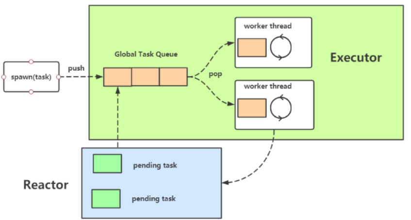

## future
```rust
type Task = Box<dyn FnMut() -> bool + Send + 'static>;
```
异步任务：不能立即完成，或需要多次执行的任务。因此不能使用 `FnOnce` 而是用 `FnMut` ， 它返回的结果是个布尔值，表示是否执行完任务。但是这样定义就有个问题，如果这个函数没有被工作线程执行完，工作线程就不知道接下来该怎么办了，如果一直等着直到这个任务能够执行，全局队列中的其他任务就不能被执行；直接扔掉这个任务也不行。因此Rust的设计用了一个很巧妙的办法，`Exector` 就不关心这个任务什么时候好，在执行的时候创建一个 `Waker`，然后告诉 task，“如果你什么时候好了，可以通过 `Waker` 把它重新放到全局队列里去” 以便再次执行，这样的话 Task 的定义就多出了 `Waker` 参数，如下所示：
```rust
type Task = Box<dyn FnMut(&Waker) -> bool + Send + 'static>;
```

这样异步任务执行没有 ready 的时候，可以将拿到 `Waker` 注册到能监控任务状态的 `Reactor` 中，如 ioepoll、timer 等，`Reactor` 发现任务 ready 后调用 `Waker` 把任务放到全局队列中。

在Rust中，我们使用的是 `Future Trait` 来定义 `Task`：
```rust
pub enum Poll<T> {
    Ready(T),
    Pending,
}

pub trait Future {
    type Output;
    fn poll(&mut self, cx: &Waker) -> Poll<Self::Output>;
    // fn poll(self: Pin<&mut Self>, cx: &mut Context<'_>) -> Poll<Self::Output>;
}
```

poll 方法返回的是一个枚举类型 `Poll`，它和返回布尔值是类似的，只不过语义会更清晰一些，如果没好的话就返回一个 `Pending`，好了的话就返回一个 `Ready`。标准库里用的不是`&mut self`，而是`Pin<&mut Self>`。

## Executor
在异步模型中，异步任务被保存在一个全局队列中，首先用户通过`Executor` 的接口把异步任务 push 到全局队列里去，然后工作线程会拿到 task 执行，并且创建一个 `Waker`，传给执行的 `Future`，如果任务执行完成了，那就 ok 了；如果没执行完成，`Future` 负责把 `Waker` 注册到 `Reactor` 上面，`Reactor` 负责监听事件，收到事件后会把 `Waker` 唤醒，把 task 放到全局队列中，这样下次其他线程可以拿到这个 task 继续执行，这样循环重复直到任务执行完毕。




## Waker
`Waker` 在这个过程中充当着十分重要的角色：
```rust
impl Waker {
    pub fn wake(self);
}

impl Clone for Waker;

impl Send for Waker;

impl Sync for Waker;

```
对于使用方的要求，首先 `Waker` 本身是唤醒的功能，所以它要提供一个 `wake` 方法。异步任务可能会关心多个事件源，比如说定时器、IO，也就是说 `Waker` 可能对应不同的 `Reactor`，因为 `Future` 在 `poll` 的时候只是传了一个 `Waker`，现在要把 `Waker` 注册到多个 `Reactor` 上，就需要 `clone`。然后 `Executor` 和 `Waker` 可能不在一个线程里面，`Waker` 需要跨线程发送到 `Reactor` 上面，所以也就需要一个 `Send` 的约束。最后多个事件源可能同时调用这个 `Waker`，这里就存在并发调用的问题，要满足并发调用的话就需要实现`Sync`约束。这是对 `Waker` 使用方的要求。

```rust

impl Waker {
    pub unsafe fn from_raw(waker: RawWaker) -> Waker
}

pub struct RawWaker {
    data: *const (),
    vtable: &'static RawWakerTable,
}

pub struct RawWakerTable {
    clone: unsafe fn(*const ()) -> RawWaker,
    wake: unsafe fn(*const ()),
    wake_by_ref: unsafe fn(*const ()),
    drop: unsafe fn(*const ())
}

```

不同的 `Executor` 有不同的内部实现，而 `Waker` 又是一个公共统一的 API。有的`Executor`有一个全局队列，有的是一个线程局部队列，有的 `Executor` 可能只支持单个 task 的执行，因此他们的唤醒机制是完全不一样的。要构造统一的 `Waker` 必然涉及多态，Rust 中是采用自定义虚表的方式实现的，通过 `RawWaker` 来构造 `Waker`，`RawWaker` 有个数据字段，和一个静态的虚表，不同的 `Executor` 就是要把这些虚表中的方法全部实现。

## 例子

### 定义Future

定义一个`TimeFuture`
```rust
pub struct TimeFuture {  
    shared_state: Arc<Mutex<SharedState>>,  
}  
  
pub struct SharedState {  
    completed: bool,  
    waker: Option<Waker>,  
}
```
它保存了当前future的状态和waker（唤醒方式）。

然后我们为它实现 `Future Trait`：
```rust
impl Future for TimeFuture {  
    type Output = ();  
    fn poll(self: Pin<&mut Self>, cx: &mut Context<'_>) -> Poll<Self::Output> {  
        let mut shared_state = self.shared_state.lock().unwrap();  
        if shared_state.completed {  
            Poll::Ready(())  
        } else {  
            shared_state.waker = Some(cx.waker().clone());  
            Poll::Pending  
        }  
    }
}
```

着重关注 `poll` 方法，我们后面的 `Executor` 会从队列中拿到 `Future` 后调用 `poll` 方法，在该方法中，我们会判断当前的状态是否是完成的，完成则返回 `Ready` ，否则从 `Context` 入参中获取 `waker` 并保存到 `Future` 中，返回 `Pending`。

然后我们定义我们的 `Future` 具体的任务：
```rust
impl TimeFuture {  
    pub fn new(duration: Duration) -> Self {  
        let shared_state = Arc::new(Mutex::new(SharedState{  
            completed: false,  
            waker: None,  
        }));        
        let thread_shared_state = shared_state.clone();  
        thread::spawn(move || {  
            thread::sleep(duration);  
            let mut shared_state = thread_shared_state.lock().unwrap();  
            shared_state.completed = true;  
            if let Some(waker) = shared_state.waker.take() {  
                waker.wake()  
            }        
        });        
        TimeFuture {shared_state}  
    }
}
```

可以看出我们设置了一个定时器，当定时器到时间后会把状态设置为完成，然后调用`Future` 保存的`waker` 进行唤醒。

### 定义Exector
```rust
struct Task {  
    future: Mutex<Option<BoxFuture<'static, ()>>>,  
    task_sender: SyncSender<Arc<Task>>,  
}

struct Executor {  
    ready_queue: Receiver<Arc<Task>>,  
}
```

```rust
impl ArcWake for Task {  
    fn wake_by_ref(arc_self: &Arc<Self>) {  
        let cloned = arc_self.clone();  
        arc_self.task_sender.send(cloned).expect("task queue full");  
    }
}
```

同时我们为 `Task` 实现 `ArcWake Trait` ，实现了该 `Trait` 就可以将Task对象动态转化为 `Waker` 并调用 `wake`方法（进一步调用的是自定义的 `wake_by_ref` ）进行唤醒。

这里为了简化，任务队列存到 `Executor` 中，然后定义  `Executor` 的执行循环：
```rust
impl Executor {
    fn run(&self) {
        while let Ok(task) = self.ready_queue.recv() {
            let mut future_slot = task.future.lock().unwrap();
            if let Some(mut future) = future_slot.take() {
                let waker = waker_ref(&task);
                let context = &mut Context::from_waker(&*waker);

                if future.as_mut().poll(context).is_pending() {
                    *future_slot = Some(future);
                }
            }
        }
    }
}
```
这里我们不断从 `ready_queue` 中获取 Task，然后将 `task`转化为 `waker` 并生成相应的 `Context`，注意这里的`context`和`waker`可以相互转化，然后我们调用 `future` 自定义的 `poll` 方法，把 `context` 当作入参传入，当然，第一次调用 `poll` 一般都是 `shared_state.completed==false` ，所以我们会在 `poll` 方法中通过 `context` 设置 `waker`。

值得注意的是：这里的Task是以引用的形式进行传递的，Task中存入的 `future` 只有一份，我们使用 `take` 将其从原位取出后检查发现还没有准备好，需要将其放回原位，以便后续的 `waker` 调用 `wake` 进一步调用 `wake_by_ref` 时能通过引用找到正确的 `future` 。

### Reactor
这里的Reactor也就是定时器事件：
```rust
impl TimeFuture {  
    pub fn new(duration: Duration) -> Self {  
        let shared_state = Arc::new(Mutex::new(SharedState{  
            completed: false,  
            waker: None,  
        }));        
        let thread_shared_state = shared_state.clone();  
        thread::spawn(move || {  
            thread::sleep(duration);  
            let mut shared_state = thread_shared_state.lock().unwrap();  
            shared_state.completed = true;  
            if let Some(waker) = shared_state.waker.take() {  
                waker.wake()  
            }        
        });        
        TimeFuture {shared_state}  
    }
}

```

当定时器事件到达是，会调用`waker.wake()` 函数，进一步调用 `wake_by_ref` 方法：
```rust
impl ArcWake for Task {  
    fn wake_by_ref(arc_self: &Arc<Self>) {  
        let cloned = arc_self.clone();  
        arc_self.task_sender.send(cloned).expect("task queue full");  
    }
}
```

在该方法中，准备好的 `Task` 将再次被发送到任务队列进行新一轮的`Poll` ，而这次将返回`Ready`。