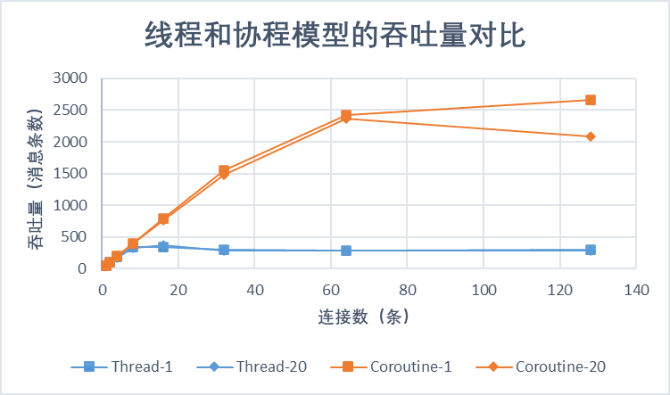
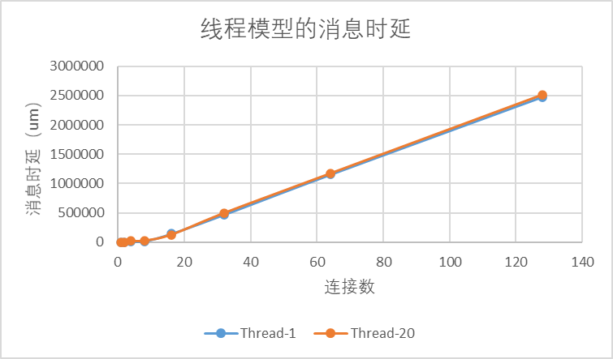
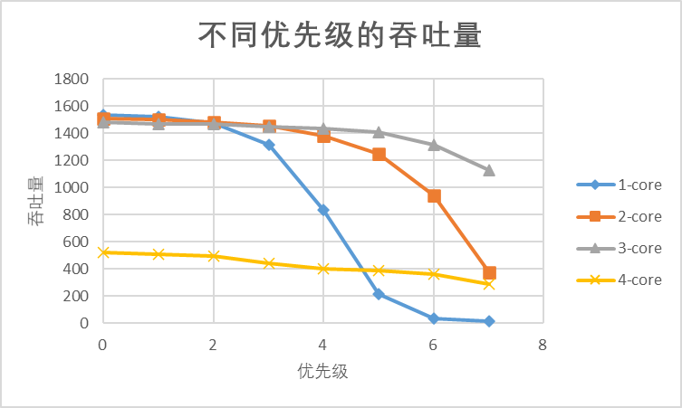

## 实验设置
使用网络驱动，客户端使用qemu外部的python脚本。

## 三个子任务都是线程模型。

matrix size: 1   ;   send timer interval: 100 ms  ； run time limit: 5000 ms

|连接数| 1 |2 | 4 | 8 | 16 | 32 | 64 | 128 | 256 |
|---|---|---|---|---|---|---|---|---| --- |
| 吞吐量(请求数) | 50 | 100   | 189 |347  | 342| 298 |285 |301| |
| 平均时延(um) | 791 | 1079  |6541  | 16499 |143680 |470232 |1152684|2478325 | |
| 时延标准差 | 172|279 |11907  | 28686 |91190 |135124 |207710 | 346251| |

matrix size: 20   ;   send timer interval: 100 ms  ； run time limit: 5000 ms

|连接数| 1 |2 | 4 | 8 | 16 | 32 | 64 | 128 | 256 |
|---|---|---|---|---|---|---|---|---| --- |
| 吞吐量(请求数) | 50 | 100  | 182 | 327 |370 | 289 |282 |292| |
| 平均时延(um) |1431 | 1710  | 17790 | 24195 |124287 |494754 |1170534| 2513742| |
| 时延标准差 | 267| 327|  14189| 35962 |89019 | 132483| 205784|358719 | |

## 三个子任务都是协程模型。

matrix size: 1   ;   send timer interval: 100 ms  ； run time limit: 5000 ms；prio(receive, server, sender) = (0, 0, 0) v-core: 4;

|连接数| 1 |2 | 4 | 8 | 16 | 32 | 64 | 128 | 256 |
|---|---|---|---|---|---|---|---|---| --- |
| 吞吐量(请求数) | 50 | 100  | 200 | 399 | 792| 1546 |2421 |2656| |
| 平均时延(um) | 700| 770  | 1134 |1475  | 2176|6288 |37742|165954 | |
| 时延标准差 |191 |250 | 736 |3184  | 12987|69068 | 215945|536350 | |

matrix size: 20   ;   send timer interval: 100 ms  ； run time limit: 5000 ms；prio(receive, server, sender) = (0, 0, 0)  v-core: 4;

|连接数| 1 |2 | 4 | 8 | 16 | 32 | 64 | 128 | 256 |
|---|---|---|---|---|---|---|---|---| --- |
| 吞吐量(请求数) | 50 | 100  | 196 | 393 | 761| 1478 |2363 |2091| |
| 平均时延(um) |1376 | 1587  | 1878 | 2223 |5501 |10059 |39600|260734 | |
| 时延标准差 |285 |636 | 1051 | 6334 |38293 | 68454|200981 | 589198| |

## 设置不同优先级组的连接，测量实验和吞吐量。

matrix size: 20   ;   send timer interval: 50 ms  ； run time limit: 5000 ms；prio(receive, server, sender) = (0, 0, 0)
8个优先级，每个优先级16个连接

Server虚拟CPU有1个时

|优先级| 0| 1 |2 | 3 | 4 | 5 | 6 | 7 |
|---|---|---|---|---|---|---|---| --- |
| 吞吐量(请求数) |1538 | 1521  | 1479 |1315  |835 | 213 |32 | 16|
| 平均时延(um) |2009 | 2566  |  4197| 11047 |46467|331123 |2468814 | 4954859|
| 时延标准差 |1739 |  2283 | 3930 |10191  |32760 | 259212| 465496| 771554|

Server虚拟CPU有2个时

|优先级| 0| 1 |2 | 3 | 4 | 5 | 6 | 7 |
|---|---|---|---|---|---|---|---| --- |
| 吞吐量(请求数) | 1511| 1504  | 1484 |1459  | 1380|1251  | 940| 375|
| 平均时延(um) |2693 | 3036  | 3419 | 4600 |8006| 14083| 35530|166514 |
| 时延标准差 |2340 | 2235  | 2640 | 4249 |7309 | 11452| 26030|82184 |

Server虚拟CPU有3个时

|优先级| 0| 1 |2 | 3 | 4 | 5 | 6 | 7 |
|---|---|---|---|---|---|---|---| --- |
| 吞吐量(请求数) |1481 | 1468  | 1471 |1451  |1437 | 1412 |1315 | 1130|
| 平均时延(um) |3463 | 3777  | 3937 | 4359 |5221|5814 | 9922|20273 |
| 时延标准差 |3297 | 3431  | 3309 | 3534 |4465 |4490 |8106 |15210 |

Server虚拟CPU有4个时

|优先级| 0| 1 |2 | 3 | 4 | 5 | 6 | 7 |
|---|---|---|---|---|---|---|---| --- |
| 吞吐量(请求数) |521 | 508  | 496 |440  |404 | 390 |360 | 290|
| 平均时延(um) |107206 | 111606  |  117506| 134996 |156461|169862 |188701 | 244605|
| 时延标准差 |202280 |  207242 | 189066 |220125  |232817 | 233787| 247760| 267210|

## 图表

### 吞吐量：

### 时延

连接少的时候，大矩阵请求（thread-20）的时延会明显高于小矩阵请求，但随着连接数不断增多，时延的开销逐渐取决于线程切换的开销，因此矩阵规模带来的差异被弱化。

而协程模型则可以比较清晰的看见大矩阵请求和小矩阵请求所带来的差异。

由于协程模型和线程模型在连接数较多时的时延差异较大，这里没有画出，但是在连接数较少的时候，他们的时延差异并不明显。

### 优先级

