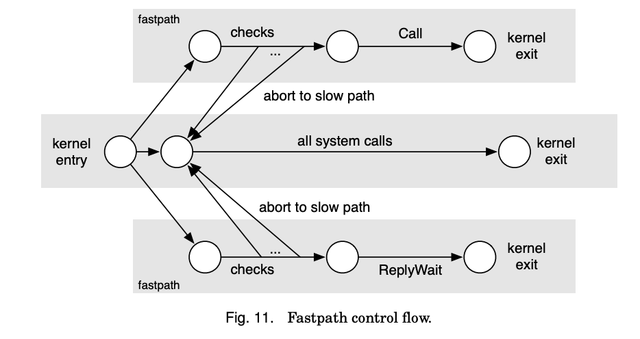

我们知道seL4脱胎于 L4 kernel，而IPC作为微内核至关重要的基础架构，决定了整个系统的性能瓶颈。seL4在继承L4的同步IPC的基础上，对其做了一定的改进和扩展。本文第一节探讨seL4在IPC方面对L4的扩展与改进。第二节总结seL4中的IPC框架。

## seL4 vs. L4

### Semaphore-like notifications for synchronisation of real concurrency.

原始的L4仅使用同步的IPC机制作为通信、同步、和信号传递的唯一机制。同步的IPC避免了内核里的消息缓存和拷贝成本。在最简单的情况下，IPC仅仅是进行上下文的切换，而没有任何的消息拷贝和传输。

虽然这种模型十分简洁且迅速，但缺点也显而易见：由于同步的限制，对于C/S结构的系统，我们只能强制使用多线程的形式来处理多个客户端的请求，这将导致线程同步的复杂性。

此外，对于多核架构，同步的IPC显然也不会适用，因为同步的IPC会导致类似RPC的服务调用被顺序排放在一个核心上，导致资源浪费。

因此seL4引入`notification` 机制，提供一个类似Unix的select的机制，详细的机制后续会介绍，但我们需要知道，`notification` 不同通过后门引入异步机制的，而是与同步IPC部分解藕的，虽然不是严格最小化的（没有提供其他机制不能模拟的功能），但它们对利用硬件的并发至关重要。

### IPC Message Structure

原始的L4的IPC有着更加丰富的语意和功能，除了可以通过寄存器传递短消息（zero-copy），几乎可以通过临时映射缓冲区传递任意长度的消息，得益于同步的IPC，这种方法避免了多余的拷贝。

原始的L4支持短消息零拷贝：发送者通过内核切换到接收者的上下文，且不更改消息寄存器即可完成消息的传递，实现了真正的零拷贝，缺点是这增加了对硬件架构的依赖性，可用的寄存器经常随着ABI的变化而变化。seL4使用固定每个线程内的一段定长内存作为虚拟寄存器，改善了跨体系结构的移植性，同时，随着CPU和内存交互效率的提高，通过硬件寄存器提升性能的收益越来越低，而且保留消息寄存器对编译器优化十分有害，因此seL4放弃了零拷贝，转向虚拟消息寄存器。

原始的L4支持长消息通过临时映射缓冲区来避免多余拷贝：但这可能会在内核中导致PageFault，这要求内核具有处理异常的能力，而且由于在微内核架构下PageFault的处理者在用户态，这导致内核中的异常处理十分复杂，seL4放弃了这种长消息的传递，转而使用notificationton + 共享内存的形式进行长消息的传递。

### IPC Destinations

原始的L4以线程作为IPC的操作目标（发送方和接收方），Liedtke （L4祖师爷）认为用端口作为操作目标会导致一定程度的TLB和缓存污染，造成12%的额外开销。使用线程作为IPC的操作目标会造成IPC必须将自己的线程信息告知对方，无法隐藏自己的身份。

seL4采用endpoint（端口）作为IPC的操作目标，这是一个单独的内核对象，而不是线程控制块的一部分，很好地隐藏了IPC双方的身份。而现代CPU通过对large-page的支持来增加端口和TCB在同一个页上的可能性，减少了TLB污染。

## IPC framework in seL4

seL4中的IPC分为 `slowpath` 和 `fastpath` 。

在开启 fast-path的系统上，用户态通过ecall陷入内核态之后，如果在trap阶段判断是`SYSCALL_CALL`或者 `SYSCALL_REPLY_RECV`，则会进入到fastpath路径。

### fastpath
在 `fastpath` 中，内核会经过一系列严苛的判断（但大部分情况下都能通过），判断通过之后就会直接拷贝消息寄存器并切换到目标线程进行执行。如果判断失败，则会老老实实走`slowpath`。这些判断包括：
- 消息长度不大于某个值（与体系架构相关）。
- 当前线程没有未处理的错误。
- 在endpoint cap上调用的IPC且该cap可以发送消息。
- endpoint对象处于Recv状态。
- 目标线程的vspace合法。
- 目标线程是当前调度域中最高优先级或不低于当前线程优先级。

通过这些检查的IPC可以以最少的代码切换到目标线程，基本可以看作是将内核看作了一个CPU驱动。
### slowpath

当fastpath不通过时，则会进入slowpath，由于slowpath与其他内核对象的 `invocation` 共用，因此会进行层层解码，根据传入的系统调用参数进行不同的处理，具体到IPC相关，主要是endpoint中的 `send_ipc` 和 `receive_ipc` ，以及 `notification` 中的 `send_signal` 和 `receive_signal`。

#### Endpoint

`endpoint` 这个内核对象维护了一个阻塞在它上面的TCB队列（当然只有头尾指针），以及它自身的状态。对于不同的状态调用不同的方法，有不同的表现。
- send_ipc
	- Idle or Send: 如果是阻塞发送，则当前线程会被加入阻塞队列，同时重新设置调度线程（调度以后单讲），并把自己的状态设置为Send。
	- Recv: 表示当前已经有线程在等待接收了，因此会将第一个等待线程出队，拷贝相关的消息寄存器，并把目标线程加入运行队列，如果当前线程调用send的endpoint cap可以被relpy cap代理，则当前线程则会被阻塞在reply cap中，同时插入目标线程的CSpace中插入Caller Slot中。否则，此线程将会被设置为 `Inactive` 状态，很难被重新调度激活。
- receive_ipc：当一个线程主动调用Recv时，如果线程有绑定的Notification并且该对象处于激活状态时，会优先Notification消息的读取。没有Notification消息时，再根据endpoint状态处理：
	- Idle or Recv: 如果是阻塞Recv，则当前线程会被加入阻塞队列，同时重新设置调度线程，并把自己的状态设置为Recv。非阻塞Recv会填充0后返回。
	- Send：表示当前已经有线程在等待发送了，因此会将第一个等待线程出队，拷贝相关的消息寄存器，并把目标线程加入运行队列，相关的reply代理与上面类似。

#### Notification

notification与endpoint内核对象略有区别，notificaiton对象包含了如下内容：
- bound tcb: 绑定的TCB指针，当绑定了TCB之后，只有绑定的TCB才能处理信号。
- queue: 等待信号的TCB队列。
- state: 对象的状态。
- msg_identifier: 每一位表示一个二值信号量。

根据notification的不同状态调用不同方法，会有不同的表现：
- send_signal: 
	- Idle: 如果当前对象有bound tcb并且该线程处于BlockOnRecv状态，则取消ipc，将通知消息发送给该线程并激活切换该线程。否则，将对象设置为Active状态。
	- Wait: 表示当前已经有线程在等待接收了，因此会将第一个等待线程出队，设置消息寄存器，激活目标线程即可。
	- Active: 表示之前已经有信号发送过来了，因此将当前的信号badge做按位或（合并信号），并返回（不阻塞）。
- receive_signal: 
	- Idle or Wait: 如果是阻塞的Wait调用，则加入阻塞队列，如果是非阻塞的Poll调用，则返回0。
	- Active: 将msg_identifier返回，并将对象状态置为Idle。

Q：如果一个处于BlockOnEndpointSend或者Reply状态的线程收到一个Notification怎么处理呢？
A：则Notification消息无法及时处理，只能等待Block的线程下次调用Wait或Polling时再处理，一般来说，不鼓励绑定了Notification的线程再调用可能阻塞本线程的Send操作。

## 中断 & 错误

- seL4中的中断可以通过IRQSetIRQHandler的系统调用进行用户态代理，实际上是将中断绑定到一个notification对象上，当中断触发时，调用对应notification的 `send_signal` 进行用户态转发即可。中断的异步性与notification有天然的适配性。
- seL4的错误处理：每个线程都有绑定一个fault_handler的endpoint用于错误处理，这里的错误不仅仅指用户态异常，还包括了内核态的一些查找错误和系统调用参数错误等。由于错误处理是天然的同步操作，因此与Endpoint有天然的适配性。