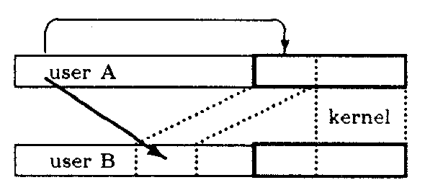

该篇文章由Jochen liedtke所写，他发现自己L3操作系统还有很多可以提升的地方，主要就是IPC的效率提升，所以写了此文。该篇文章的确是引导做研究的好文章，在整体结构上，该篇文章首先抛出了IPC困境，IPC提升了操作系统灵活度，进程间交流通过IPC方便了不少，可是IPC的通讯压力又太大。然后，该文介绍了设计改进，并最后20倍地提升了IPC速度。

## 架构方面改进

### 新增系统调用

创建了新的RPC函数，reply&receve next，将RPC通信的消息传递过程从4次变为2次

### 消息结构设计

设计L3中的IPC消息包含直接字符串、非直接字符串和内存对象。直接字符串存放一些操作码/指令；非直接字符串放具体消息的地址，内存对象设计用于特别的传输。

### 通过临时映射直接传递消息

IPC过程需要严格控制的一个点是保证用户态下的进程只能访问到自己的地址空间。初步设计为线程A->内核->线程B的消息传递，2次复制过程。
再考虑可能采取共享内存的方式实现单次复制，同时需要考虑系统安全，需要内核的介入。
所以，为了实现内核介入的单次复制过程，文章提出的发送消息方式在进程的地址空间划分内核段，发送方发送消息到自己地址空间的内核段，内核段直接映射到接收方的接收空间所映射的物理地址上。
进程留予的内存用于IPC的那段空间成为Communication Window，为了让每个线程都得到完全的使用，在线程切换时将unmap物理地址，切换回去的时候再交由发生的缺页中断重新映射上之前的物理地址。

### 面向进程
为了简单、高效，临时处于内核态的线程也应该与运行在用户态类似。一个线程对应一个内核栈。

### 控制块作为线程栈虚拟对象

**TCB**用于保存线程与硬件相关的信息，包括寄存器、状态信息和内核栈。一个高效的方法是将所有tcb都放在一个虚拟的数组中。这个数据结构只能内核访问。这样做的好处包括：
- TCB索引速度快：数组基地址+TCB编号*TCB大小。此外，这样的设计下，去检查某一个地址的TCB是否存在或者是否被交换就成为了多余，缺页中断会解决这件事情。
- 在IPC过程中，这样的设计节省了过程中的3类TLB miss。1）因为直接检索TCB不需要另外使用一个表进行寻找。2、3：检索ipc发送方和接收方的内核栈不需要（因为和TCB在一页上）。
- 给一个线程加锁可以简单的通过不映射该线程的tcb块解决。
- 这将有助于线程的持久化。（？？）
- 这使得IPC可以正交/独立于内存管理，消息传递期间的缺页中断和tcb被换出是不可见的。（？？）

## 算法层面

- 线程描述符的设计： 64位线程的uid设计使得地址空间可以经由位运算快速检索。
- 虚拟队列的处理： 内核根据线程类型，工作任务建立了很多存放TCB指针的队列，这个时候对于这些队列中的TCB需要维护，线程结束运行后需要及时移除。避免缺页中断（避免已经不存在的线程带来发生缺页的事故）。
- 超时与唤醒：IPC过程会设计超时，本文这里按照超时时间的不同划分了多个队列减少顺序检索开销。对于特别长超时的消息（t>天）设计base+offset的方式存储到特殊队列。
- 懒调度：IPC过程对于线程的就绪ready、等待wait状态是有队列保存的，通信过程中需要时常删除或加入TCB到不同队列。本文根据TCB中线程state确定线程的状态信息，可以晚些甚至无需总是开销时间在维护队列上，特别在IPC频繁的时候这样的队列操作很多。此外，对于被中断切下的线程需要存储到Ready队列中方便下次CPU再切回。这样的中断包括3种：1)时间片耗尽、2)硬件中断、3)send操作（阻塞）。
- 按照IPC过程的队列，切换进程到ready线程。直接切换过程只需要调整栈指针和地址空间，速度很快。
- 利用寄存器发送一些常量（ack/error_code等）

# Personal Thinking

1. 所有的IPC都看作是同步，就完全放弃异步IPC了吗？
	1. seL4 在保留了同步IPC的同时引入了新的Notification机制来实现异步的IPC。同时 seL4 还支持 `slowpath` 和 `fastpath` 的统一调用入口，判断是否能进入 `fastpath` 由内核进行。
2. 使用消息寄存器来实现 zero copy，可用的消息寄存器的数量与硬件平台严重耦合的。
	1. L4的继承者（seL4、Fiasco.OC、Pistachio）都使用一个虚拟消息寄存器来进行，其中的一部分映射到物理寄存器，另一部分固定在地址空间的固定位置，通过内联函数来隐藏物理寄存器和内存支持的寄存器的区别。
3. 通过临时映射来传递长消息，可能会在源地址空间或目标地址空间中复制期间触发页面错误，这需要内核处理嵌套异常，使得内核设计变得复杂。
	1. seL4 放弃了长消息的IPC。长 IPC 的主要用途是用于服务器的 POSIX 风格的读写接口，这需要将任意缓冲区的内容传输到不一定有权访问客户端内存的服务器。 然而，作为 POSIX 中间件的虚拟化 Linux 的兴起，Linux 与其应用程序有效地共享内存，用引用传递取代了这种常见的用例。 其余用例要么具有接口灵活性，要么可以使用共享内存实现。 Long IPC 也违反了极简原则，即只讲功能，不讲性能。
