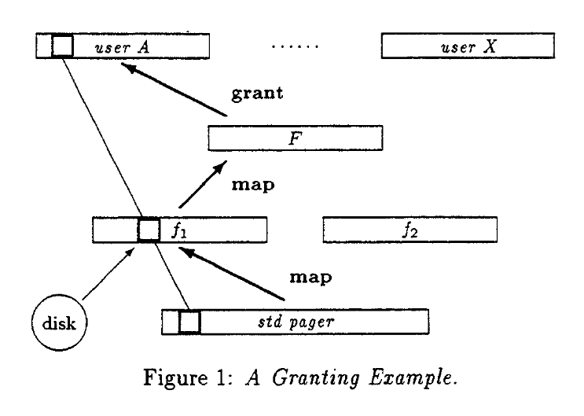

# 微内核的一些基本概念

## 地址空间
微内核是所有应用程序共有的一层，必须隐藏地址空间的硬件概念，同时允许在微内核之上实施保护和非保护的方案。

一个简单的idea是支持递归构建在内核之外的地址空间，最开始有一个地址空间 $\sigma_0$ 代表物理地址并且被子系统 $S_0$ 控制，在系统启动时，其他所有的地址空间都是空的，为了构建和维护在 $\sigma_0$ 之上的地址空间，微内核需要提供三种操作：
- grant：地址空间的所有者可以将自己的页授权给其他地址空间，授权之后从原先的地址空间删除，转移到新的地址空间。需要注意的是，授权者授权的是自己可以访问的页面的权力，而不是物理页框本身。
- map：地址空间所有者可以映射自己拥有的任何页到其他地址空间，类似于共享内存。
- Flush：删除从flusher中直接或间接得到页访问权的地址空间中的相应页。

内核只提供这地址空间的三种操作，地址空间的管理全部在内核之外。

通常情况下，系统使用grant来实现页面映射的传递，这样可以防止多次map导致的bookkeeping和内存过多占用。

在该模型的基础上，可以很容易的附加访问权限控制，如在map和grant时同时复制访问权限或其子集，flush操作仅仅移除某些权限等等。

## Thread and IPC
线程的抽象基本和宏内核类似，是运行CPU的抽象，但有以下区别：
- 为了防止地址空间污染，所有的对线程的地址空间的修改必须通过内核控制。（why？）
IPC作为构建系统的基础功能需要内核参与。
内核不保留中断的语义信息，将中断原封不动交由用户态进行处理（类似于用户态中断？）

## 唯一标识符
由于IPC需要标识符来指明发送端和接收端，因此内核还需要维护各个对象的全局唯一的标识符。

# 几个子系统的基本实现

## 内存管理

一个初始服务器子系统$M_0$构造了初始的地址空间$\sigma_0$ 这个子系统是一个传统的主存储管理系统，但是在内核之外。$M_0$ 通过map或grant将部分物理地址从 $\sigma_0$转移到子系统$M_1$ 下的地址空间 $\sigma_1$ 和子系统 $M_2$ 下的地址空间 $\sigma_2$ ，现在就有两个共存的内存管理器了。

## 分页管理（Pager）

