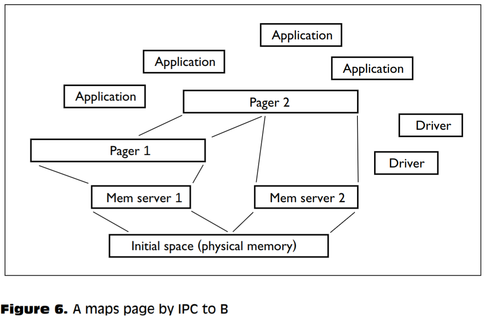

这是一篇微内核发展的综述论文。

# 第一代微内核——以Mach为代表

## Externel Pager
- 在内核中管理物理和虚拟内存。
- 在内核外处理页错误。

memory object： Mach中的抽象，用以支持辅助存储，表示数据字节的集合，在其上定义了多个操作（如读写.....）。
###  Creating and Mapping a Memory Object
```
                       ________
                      /        \
                     |   Mach   |
                      \________/
                 /| /           |\  \
    (C) vm_map  /  / m_o_ready (E)\  \ (D) memory_object_init
               / |/ (F) return     \  \|
            ________              ________
           /        \   ----->   /        \
          |  Client  | (A) open |  Pager   |
           \________/   <-----   \________/
                 (B) memory_object
```

- Client（应用程序）发送`open` RPC给Pager。
- Pager受到请求后创建一个memory object（一个接受请求的port）。并将其加入监听队列中，返回一个memory object（发送请求的port）给Client。
- Client 调用 `vm_map` RPC。发送请求给Mach内核，将port引用传给Mach。
- Mach之前未曾见过这个object，因此需要通过该port发送 `memory_object_init` RPC给Pager。发送参数还包含了内核的send right（the memory control port），作为未来交互的身份验证机制：提供端口以便Pager能够识别给定 memory_object_* IPC 来自哪个内核。
- Pager收到 `memory_object_init` 后初始化内部的数据结构并返回Ready。
- 内核收到Ready后设置在Client的地址空间设置合适的映射，然后返回 `vm_map` 的结果。

当Client第一次访问该虚拟地址的时候，会产生Page Fault。

### Page Fault


```
  (G) Client      ________
      resumed    /        \
                |   Mach   |
 (A) Fault +----|------+   |  \ (B) m_o_request  (C) store_read
       ____|___  \_____|__/ |\  \| ________         _________  
      /    +---\-------+       \  /        \       /         \ 
     |  Client  |          (F)   |  Pager   |<===>|  storeio  |
      \________/       m_o_supply \________/       \_________/ 
                                      (E) return data  | ^
                                                       | | (D) device_read 
                                                       v |
                                                     ________
                                                    / Device \
                                                   |  Driver  |
                                                    \________/
                                                       | ^
                                                       | |
                                                       v
                                                  ____________
                                                 /  Hardware  \
```

- Client进行访存时发现虚拟地址对于的页不在内存，Kenerl捕获到错误之后找到虚拟地址对应的memory object（之前注册过），通过它来发送`memory_object_request` 消息，同时发送的还有当前内核的 send right（理由同上）。
- Pager收到消息后就会会向storeio（理解为一个文件系统）请求数据。
- storeio通过设备驱动从硬件将数据读入一个匿名的page（在default pager中分配）后解开自己地址空间的映射关系。
- storio将匿名page传回Pager后，Pager传回内核。
- 内核收到传回的page之后建立新的映射，缓存page，然后重启应用程序。

## Handling hardware interrupts as IPC messages 

内核捕获中断但不处理，而是生成消息发送到用户态的处理程序。

内核态需要处理中断，则I/O端口需要映射到相应的地址空间中去。

```
driver thread:
	do
		wait for (msg, sender);
		if sender = my hardware interrupt
			then read/write i/o ports;
				reset hardware interrupt
			else ...
		fi
	od
```


# 第二代微内核——以L4为代表

L4 基于效率和灵活性需要最小的通用微内核抽象集的原则。它的高效实现依赖于处理器，导致L4本质上是不可移植的。

相比与第一代，主要的提高点是：
1. IPC速度提高了20倍（how？）
2. Externel Pager在第一代中频繁与kernel通信导致，导致效率较低，而且也限制了Pager的进一步扩展。在L4的地址空间概念中，内核不再提供任何策略，而是仅仅提供用户态实现合适的策略所需要的基本接口。

## Address Space

见 `On micro-kernel Construction` 的笔记。

## Pager

### Memory Manage

有一个在内核外的管理初始地址空间（Initial space）的主内存管理器。然后主内存管理器通过 `map` 或 `grant` 分裂成 mem server 1 和 mem server 2。Pager则可以使用这些内存服务。



其余接口
- pager <-->client
- pager <--> memory server
- pager <--> device driver
都使用IPC实现并且定义在kernel 外。

Pager可以用于实现传统的分页虚拟内存和文件/数据库映射。

### Page Fault
L4 内核维护页表，包含了用户程序建立的映射关系。当出现page fault时：
- L4 内核代表用户线程发送 IPC消息给Pager。
- Pager分配页之后将页帧号传回内核。
- 内核更新页表，返回用户程序继续执行。

## Personal Thinking
1. 关于L4，Pager到底是如何分配内存的？
	1. L4系统在启动的时候有一个sigma0任务拥有整个物理内存，在用户态我们可以编写用户程序来继承 sigma0的全部或部分内存（使用map），设为sigma 1任务，在sigma 1上我们就可以实现我们自己想要的内存分配算法，然后在sigma 1上新建一个任务 task，设置task的pager为sigma 1，运行我们自己任务，最开始运行的时候，会产生 page fault，此时缺页异常会交给pager（即sigma 1）进行处理，pager会通过map操作从自己的地址空间中选出一个页来映射给异常的虚拟地址（使用map）。
2. L4采用 Sigma0协议管理内存，如果程序B要使用程序A的内存，只需要把程序A设置为程序B的 Pager，然后在程序B中设置相应的page_fault_handler即可。什么情况下要B使用A的内存？
	1. shared_memory.
3. Mach和L4的pager的对比：
	1. Mach的Pager仅仅只是处理缺页异常，物理内存管理则由内核完成，而L4的Pager还会将自己的物理内存映射给应用程序。
	2. L4的Pager的扩展性更好，可以嵌套构建。
4. 这里的L4 Pager嵌套构建跟宏内核共享内存的区别：
	1. 宏内核中的两个进程对共享内存是相互平等的，而L4中有一个任务是内存所有者，随时可以撤销其他人的内存，这样做的好处是安全。
5. 虽然文章中指出L4的IPC时延5~18 微秒（随传输参数增加而增加），而一次系统调用约为20微秒，但是一次系统调用往往要多次IPC来代替，因此效率可能还是会逊色？
6. L4的IPC是怎么降到10微妙左右的？