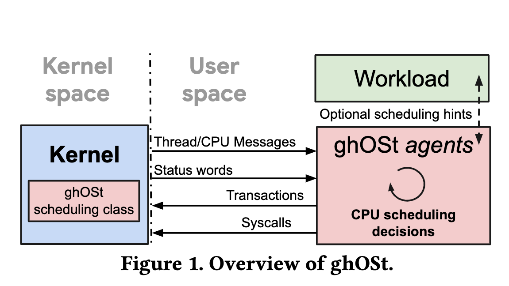

## Background

- Linux 调度：提供默认的五种调度类，程序开发人员可以选择不同的调度类来适应不同的程序需求。原则上，云提供商和程序开发人员可以创建一个全新的调度类或调度策略来优化自己程序的性能。但是由于开发难度和调试难度，大多数更愿意使用通用的Linux调度策略如CFS。因此Linux的调度策略需要最大程度通用化，这导致对于某些特定需求的应用调度不够充分。
- 实现内核调度十分困难：自己在内核中实现调度策略只能使用朴实无华的C语言，无法使用一些功能强大的外部库，也无法使用一些先进的调试工具，此外，内核中的调度开发涉及到由原子操作提供的同步原语、任务抢占和硬件中断等，使得开发调试更加困难；最后，Linux的主线分支不太可能接受一个高度调优的策略进入内核主线，因此长期游离于主线的分支维护起来十分困难，需要不断同步主线的各种补丁。
- 部署困难：新开发的调度策略需要同整个内核一同编译部署，在部署期间，机器上的所有服务都将重启，内存中的所有程序缓存都会被驱逐，造成长时间的服务性能问题；此外，由于新上线的调度策略在初期不会十分稳定，通常会经过若干次修补，因此会重复造成上述问题。
- 用户级线程能力不足：用户态往往只能决定用户态线程的调度，无法决定内核线程的调度情况，一种极端情况是：内核放弃调度了持有用户态锁的某个线程，这将导致其他等待该锁的线程的无效调度。
- 为每种工作负载定制不同的内核调度平面是不现实的：此前已经有了很多针对某类工作负载高度调优的调度策略在内核中的实现，但实验都证明了在其他工作负载上，这些调优的调度策略表现很差。内核调度为所有应用共用，因此为不同的工作负载定制不同的内核调度策略是不现实的。
- 通过BPF定制调度策略能力不足：虽然可以通过BPF的方式重写内核的调度函数，但BPF存在很多限制：某些内核数据结构无法访问、循环必须安全退出、无法使用浮点。此外，BPF程序是同步运行的，而对于一个全局调度器，异步处理调度事件才能更好的调度任务。

## Design

策略开发人员将调度策略运行在用户态的agents进程中，该进程有若干个agent线程，其他应用通过某个系统调用将自己绑定到agents调度中，所以一个agent线程绑定了若干个可调度的线程，agent线程通过观察这些线程的状态来进行调度决策，并指导内核进行相应的调度。

### per-CPU Scheduler & Centralized Scheduler

- per-CPU scheduler: 每个CPU单独决定自己应该运行哪一个线程。
- Centralized scheduler: 整个系统中由一个统一的center决定某个线程应该到哪个CPU上运行。
### Kernel-to-Agent Communication

每当线程状态发生变化时，内核需要通知该线程绑定的agent，文章采用的是消息队列的方式。消息队列与agent的对应关系取决于调度策略的实现，对于per-CPU scheduler调度，每个CPU对应一个agent，每个agent对应一个queue，对于centralized scheduler，每个CPU对应一个agent，但全局始终只有一个激活的agent，对应一个全局的queue。

- ghOSt messages: 当某个线程状态发生变化时，内核会将状态改变的事件消息发送到消息队列，如 `THREAD_WAKEUP` 。
- Message queues: 虽然Linux内核中已经有很多好用的消息队列，但都对Linux版本有一定要求，因此这里自己实现了消息队列。
- Thread-to-queue association：agent可以通过 `CREATE/DESTROY_QUEUE()` 来创建和销毁消息队列，thread默认会绑定到agent绑定的消息队列，但也可以使用 `ASSOCIATE_QUEUE` 来更改消息队列。
- Moving threads between queues/CPUs:  在per-CPU的调度策略中，可能需要为了负载均衡而进行一些任务窃取的策略，agents可以通过 `ASSOCIATE_QUEUE` 来更改线程消息的路由，这取决于用户态实现的调度策略。

### Agent-to-Kernel Communication

agent会根据用户定义的调度策略选出下一个要执行的线程，以及要放到哪个CPU上执行，然后将决策传递给内核，由内核执行决策。

- Sending scheduling decisions via transactions: agent提交决策可能需要指导本地CPU和远程CPU，这需要commit机制支持微秒级延迟以及上百个核心的横向扩展。对于per-CPU调度，使用系统调用就已经足够。而对于Centralized调度，使用共享内存会更加合适一些。此外，使用共享内存还有个好处就是可以在将来把调度决策卸载到能够访问该内存的其他硬件上，从而解放CPU，因此最终方案选择使用共享内存。
- Group commits: 在Centralized调度中可能会处理大量commit，为了减少系统调用次数，这里支持批量commit。
- Accelerating scheduling with BPF: ghOSt为了弥补Centralized调度带来的延迟（从线程状态变化之后，到收到新的调度决策，大约为30 𝜇s），允许在agent中编写ebpf程序来重写内核的 `pick_next_task` 函数，当cpu处于空闲状态并且agent没有commit的时候内核会运行重写后的 `pick_next_task` 来进行加速，调度的正确性和一致性由用户态的调度策略保证。

## Evaluation

参考：[SOSP 2021 小镇奇闻连载（七） - 知乎 (zhihu.com)](https://zhuanlan.zhihu.com/p/464560315)